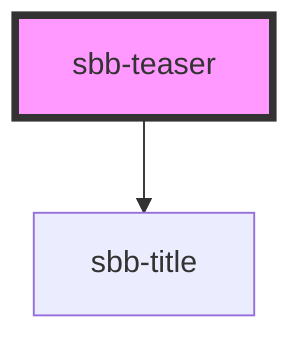

The sbb-teaser acts as a link containing an image next to a title and a description.
It's important to set the accessibilityLabel which describes the teaser for screenreader users.
The title level can be set by the consumer.

## Accessibility

The description text is wrapped into an `
` element to guarantee the semantic meaning.
Depending on which elements are going to be slotted, it can violate semantic rules (e.g. slotting in a `
` element).

<!-- Auto Generated Below -->

## Overview

Generalized Teaser - for displaying an image, title and paragraph

## Properties

| Property     | Attribute     | Description                                                                                                                   | Type                                     | Default     |
| ------------ | ------------- | ----------------------------------------------------------------------------------------------------------------------------- | ---------------------------------------- | ----------- |
| `href`       | `href`        | The href value you want to link to.                                                                                           | `string`                                 | `undefined` |
| `isStacked`  | `is-stacked`  | Teaser variant - when this is true the text-content will be under the image otherwise it will be displayed next to the image. | `boolean`                                | `undefined` |
| `rel`        | `rel`         | The relationship of the linked URL as space-separated link types.                                                             | `string`                                 | `undefined` |
| `target`     | `target`      | Where to display the linked URL.                                                                                              | `string`                                 | `undefined` |
| `titleLevel` | `title-level` | Heading level of the sbb-title element (e.g. h1-h6).                                                                          | `"1" \| "2" \| "3" \| "4" \| "5" \| "6"` | `'5'`       |

## Slots

| Slot            | Description                         |
| --------------- | ----------------------------------- |
| `"description"` | Slot used to render the description |
| `"image"`       | Slot used to render the image       |
| `"title"`       | Slot used to render the title       |

## Dependencies

### Depends on

- [sbb-title](../sbb-title)

### Graph

----------------------------------------------

