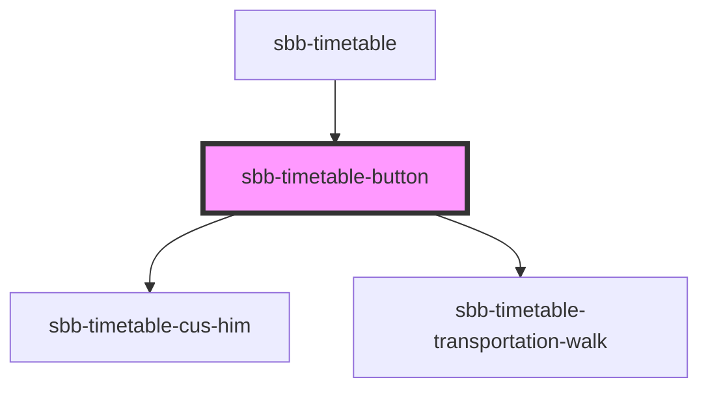

# sbb-timetable-button

<!-- Auto Generated Below -->

## Properties

| Property       | Attribute       | Description                                                                                                                                   | Type                                                                  | Default                 |
| -------------- | --------------- | --------------------------------------------------------------------------------------------------------------------------------------------- | --------------------------------------------------------------------- | ----------------------- |
| `appearance`   | `appearance`    | Set the desired appearance of the component.                                                                                                  | `"cus-him" \| "earlier-connections" \| "later-connections" \| "walk"` | `'earlier-connections'` |
| `ariaHaspopup` | `aria-haspopup` | If you use the button to trigger another widget which itself is covering the page, you must provide an according attribute for aria-haspopup. | `"dialog" \| "grid" \| "listbox" \| "menu" \| "tree" \| "true"`       | `undefined`             |
| `config`       | `config`        | If appearance is set to 'cus-him' or 'walk', we need to provide a config to popultate the nested web component.                               | `string`                                                              | `undefined`             |
| `disabled`     | `disabled`      | Set to true to get a disabled button                                                                                                          | `boolean`                                                             | `false`                 |
| `eventId`      | `event-id`      | Id which is sent in the click event payload                                                                                                   | `string`                                                              | `undefined`             |
| `expanded`     | `expanded`      | Set to true to initially show the state, which would get set by pressing the button.                                                          | `boolean`                                                             | `undefined`             |
| `name`         | `name`          | The name attribute to use for the button                                                                                                      | `string`                                                              | `undefined`             |

## Dependencies

### Used by

- [sbb-timetable](../sbb-timetable)

### Depends on

- [sbb-timetable-cus-him](../sbb-timetable-cus-him)
- [sbb-timetable-transportation-walk](../sbb-timetable-transportation-walk)

### Graph

---
