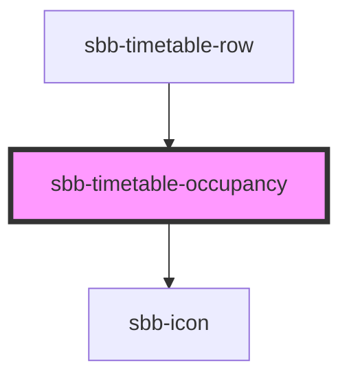

!! Please note that this component is not intended for direct use. It will get used within sbb-timetable. It is listed
here to show the various configuration options to component developers. !!

<!-- Auto Generated Below -->

## Properties

| Property    | Attribute  | Description                     | Type                                                           | Default     |
| ----------- | ---------- | ------------------------------- | -------------------------------------------------------------- | ----------- |
| `negative`  | `negative` | Negative coloring variant flag. | `boolean`                                                      | `false`     |
| `occupancy` | --         | Occupancy object.               | `{ firstClass?: OccupancyEnum; secondClass?: OccupancyEnum; }` | `undefined` |

## Dependencies

### Used by

 - [sbb-timetable-row](../sbb-timetable-row)

### Depends on

- [sbb-icon](../sbb-icon)

### Graph

----------------------------------------------

