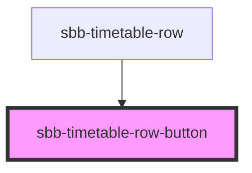

# sbb-timetable-row-button

!! Please note that this component is not intended for direct use. It will get used within sbb-timetable. It is listed
here to show the various configuration options to component developers. !!

<!-- Auto Generated Below -->

## Properties

| Property                | Attribute                | Description                                                                          | Type      | Default     |
| ----------------------- | ------------------------ | ------------------------------------------------------------------------------------ | --------- | ----------- |
| `accessibilityControls` | `accessibility-controls` | The aria-controls prop for the button.                                               | `string`  | `undefined` |
| `accessibilityHaspopup` | `accessibility-haspopup` | The aria-haspopup prop for the button.                                               | `string`  | `undefined` |
| `accessibilityLabel`    | `accessibility-label`    | The aria-label prop for the button.                                                  | `string`  | `undefined` |
| `disabled`              | `disabled`               | The disabled prop for the button.                                                    | `boolean` | `undefined` |
| `expanded`              | `expanded`               | Set to true to initially show the state, which would get set by pressing the button. | `boolean` | `undefined` |
| `name`                  | `name`                   | The name prop for the button.                                                        | `string`  | `undefined` |
| `role`                  | `role`                   | The role prop for the button.                                                        | `string`  | `undefined` |
| `tab`                   | `tab`                    | The tabIndex prop for the button.                                                    | `number`  | `undefined` |

## Events

| Event                        | Description                                  | Type               |
| ---------------------------- | -------------------------------------------- | ------------------ |
| `sbbTimetableRowButtonClick` | Event for emiting whenever state is changed. | `CustomEvent<any>` |

## Dependencies

### Used by

 - [sbb-timetable-row](../sbb-timetable-row)

### Graph

----------------------------------------------

