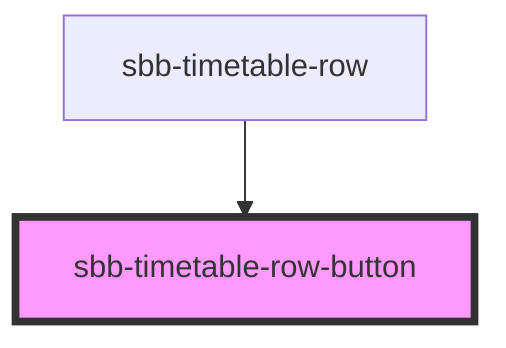

# sbb-timetable-row-button

!! Please note that this component is not intended for direct use. It will get used within sbb-timetable. It is listed
here to show the various configuration options to component developers. !!

<!-- Auto Generated Below -->

## Properties

| Property   | Attribute  | Description                                                                          | Type      | Default     |
| ---------- | ---------- | ------------------------------------------------------------------------------------ | --------- | ----------- |
| `eventId`  | `event-id` | Id which is sent in the event of clicking the button                                 | `string`  | `undefined` |
| `expanded` | `expanded` | Set to true to initially show the state, which would get set by pressing the button. | `boolean` | `undefined` |

## Dependencies

### Used by

 - [sbb-timetable-row](../sbb-timetable-row)

### Graph

----------------------------------------------

