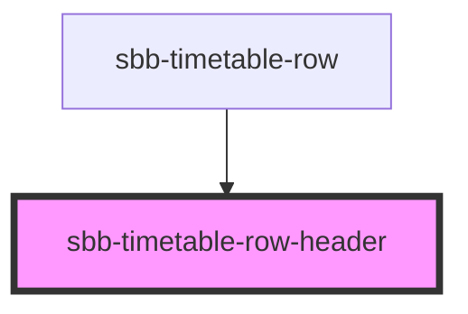

# sbb-timetable-row-header

!! Please note that this component is not intended for direct use. It will get used within sbb-timetable. It is listed
here to show the various configuration options to component developers. !!

<!-- Auto Generated Below -->

## Properties

| Property              | Attribute | Description | Type     | Default     |
| --------------------- | --------- | ----------- | -------- | ----------- |
| `config` _(required)_ | `config`  |             | `string` | `undefined` |

## Dependencies

### Used by

 - [sbb-timetable-row](../sbb-timetable-row)

### Graph

----------------------------------------------

