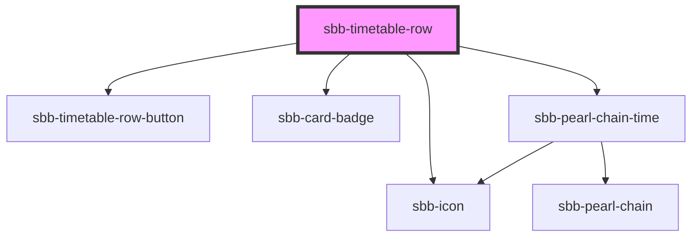

# sbb-timetable-row

<!-- Auto Generated Below -->

## Properties

| Property             | Attribute             | Description                                                                                       | Type                                                                                                                     | Default     |
| -------------------- | --------------------- | ------------------------------------------------------------------------------------------------- | ------------------------------------------------------------------------------------------------------------------------ | ----------- |
| `accessibilityLabel` | `accessibility-label` | This will be forwarded as aria-label to the relevant element.                                     | `string`                                                                                                                 | `undefined` |
| `disableAnimation`   | `disable-animation`   | This will be forwarded to the sbb-pearl-chain component - if true the position won't be animated. | `boolean`                                                                                                                | `undefined` |
| `loadingPrice`       | `loading-price`       |                                                                                                   | `boolean`                                                                                                                | `undefined` |
| `loadingTrip`        | `loading-trip`        |                                                                                                   | `boolean`                                                                                                                | `undefined` |
| `price`              | --                    |                                                                                                   | `{ price: string; text: string; isDiscount: boolean; }`                                                                  | `undefined` |
| `trip`               | --                    | The trip Prop                                                                                     | `{ legs?: Leg[]; notices?: Notice[]; situations?: PtSituation[]; summary?: TripSummary; id?: string; valid?: boolean; }` | `undefined` |

## Dependencies

### Depends on

- [sbb-timetable-row-button](../sbb-timetable-row-button)
- [sbb-card-badge](../sbb-card-badge)
- [sbb-icon](../sbb-icon)
- [sbb-pearl-chain-time](../sbb-pearl-chain/sbb-pearl-chain-time)

### Graph

----------------------------------------------

