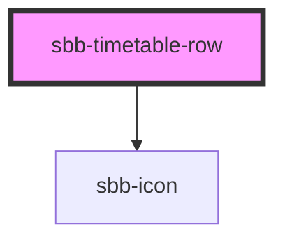

# sbb-timetable-row

<!-- Auto Generated Below -->

## Properties

| Property            | Attribute            | Description | Type     | Default                   |
| ------------------- | -------------------- | ----------- | -------- | ------------------------- |
| `accessiblityLabel` | `accessiblity-label` |             | `string` | `undefined`               |
| `direction`         | `direction`          |             | `string` | `'Richtung Hauptbahnhof'` |
| `pictogramName`     | `pictogram-name`     |             | `string` | `'tick-small'`            |
| `transportNumber`   | `transport-number`   |             | `string` | `undefined`               |

## Dependencies

### Depends on

- [sbb-icon](../sbb-icon)

### Graph

----------------------------------------------

