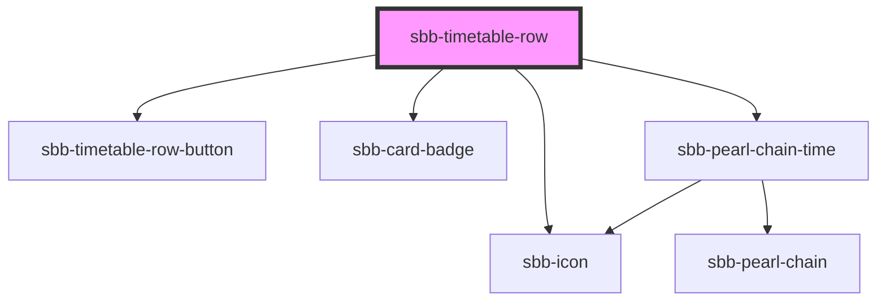

The `<sbb-timetable-row>` component displays a journey.  


## Usage 

The args are the same, as in the table below. If the `loading-trip` property is true, the whole row is displayed with an loading animation instead of the data. The `loading-price` property does the same for the card-badge.

```html
<sbb-timetable-row {...args}></sbb-timetable-row>
```

<!-- Auto Generated Below -->


## Properties

| Property             | Attribute             | Description                                                                                       | Type                                                                                                                     | Default     |
| -------------------- | --------------------- | ------------------------------------------------------------------------------------------------- | ------------------------------------------------------------------------------------------------------------------------ | ----------- |
| `accessibilityLabel` | `accessibility-label` | This will be forwarded as aria-label to the relevant element.                                     | `string`                                                                                                                 | `undefined` |
| `disableAnimation`   | `disable-animation`   | This will be forwarded to the sbb-pearl-chain component - if true the position won't be animated. | `boolean`                                                                                                                | `undefined` |
| `loadingPrice`       | `loading-price`       | When this prop is true the badge for the price will appear loading                                | `boolean`                                                                                                                | `undefined` |
| `loadingTrip`        | `loading-trip`        | The loading state - when this is true it will be render skeleton with an idling animation         | `boolean`                                                                                                                | `undefined` |
| `price`              | --                    | The price Prop,  which consits of the data for the badge                                          | `{ price: string; text: string; isDiscount: boolean; }`                                                                  | `undefined` |
| `trip`               | --                    | The trip Prop                                                                                     | `{ legs?: Leg[]; notices?: Notice[]; situations?: PtSituation[]; summary?: TripSummary; id?: string; valid?: boolean; }` | `undefined` |


## Events

| Event                     | Description                                                         | Type               |
| ------------------------- | ------------------------------------------------------------------- | ------------------ |
| `sbb-timetable-row_click` | This click event gets emitted when the user clicks on the component | `CustomEvent<any>` |


## Dependencies

### Depends on

- [sbb-timetable-row-button](../sbb-timetable-row-button)
- [sbb-card-badge](../sbb-card-badge)
- [sbb-icon](../sbb-icon)
- [sbb-pearl-chain-time](../sbb-pearl-chain/sbb-pearl-chain-time)

### Graph


----------------------------------------------


