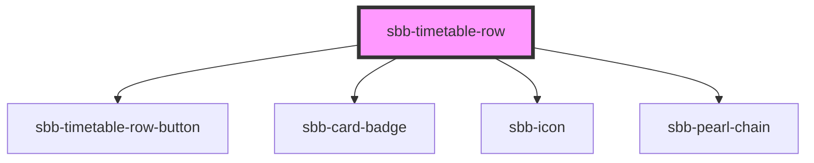

# sbb-timetable-row

<!-- Auto Generated Below -->

## Properties

| Property             | Attribute             | Description                                                                               | Type                                                                                                                                     | Default     |
| -------------------- | --------------------- | ----------------------------------------------------------------------------------------- | ---------------------------------------------------------------------------------------------------------------------------------------- | ----------- |
| `accessibilityLabel` | `accessibility-label` | This will be forwarded as aria-label to the relevant element.                             | `string`                                                                                                                                 | `undefined` |
| `config`             | --                    | The config Prop                                                                           | `{ price: string; legs: Leg[]; notices?: Notice[]; situations?: PtSituation[]; summary: TripSummary; tripId: string; valid?: boolean; }` | `undefined` |
| `loading`            | `loading`             | The loading state - when this is true it will be render skeleton with an idling animation | `boolean`                                                                                                                                | `false`     |

## Dependencies

### Depends on

- [sbb-timetable-row-button](../sbb-timetable-row-button)
- [sbb-card-badge](../sbb-card-badge)
- [sbb-icon](../sbb-icon)
- [sbb-pearl-chain](../sbb-pearl-chain)

### Graph

----------------------------------------------

