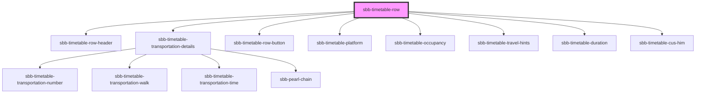

# sbb-timetable-row

<!-- Auto Generated Below -->

## Properties

| Property              | Attribute | Description                                                                                                                               | Type     | Default     |
| --------------------- | --------- | ----------------------------------------------------------------------------------------------------------------------------------------- | -------- | ----------- |
| `config` _(required)_ | `config`  | Stringified JSON which defines most of the content of the component. Please check the individual stories to get an idea of the structure. | `string` | `undefined` |

## Dependencies

### Depends on

- [sbb-timetable-row-header](../sbb-timetable-row-header)
- [sbb-timetable-transportation-details](../sbb-timetable-transportation-details)
- [sbb-timetable-row-button](../sbb-timetable-row-button)
- [sbb-timetable-platform](../sbb-timetable-platform)
- [sbb-timetable-occupancy](../sbb-timetable-occupancy)
- [sbb-timetable-travel-hints](../sbb-timetable-travel-hints)
- [sbb-timetable-duration](../sbb-timetable-duration)
- [sbb-timetable-cus-him](../sbb-timetable-cus-him)

### Graph

---
