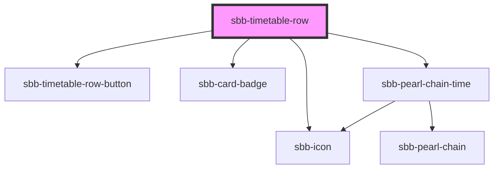

The `<sbb-timetable-row>` component displays a journey. The whole component is clickable and therefore emits a click-event. A Journey consits of various icons that display information about the means of transport, the occupancy in the first and second class, the most important warning for the trip and travel hints. Train changes are displayd in a pearl chain, which has the capability to show, if a connection is in the past, future or cancelled. In addtition to that, the current position within the journey can be shown.
## Usage with props
Example props:  priceProp: {price:'12', text: 'CHF', isDiscount: true} <br>
                tripProp: {
                  legs: [
                    {
                      duration: 360,
                      id: 'test',
                      arrival: { time: '2022-08-40T15:00:00+02:00' },
                      departure: { time: '2022-04-30T15:00:00+02:00' },
                      serviceJourney: {
                        serviceAlteration: {
                          cancelled: false,
                        },
                      },
                    },
                  ],

```html
<sbb-timetable-row accessibility-label="label" disable-animation={false} loading-price={false} loading-trip={false} 
price={priceProp} trip={tripProp}></sbb-timetable-row>
```


<!-- Auto Generated Below -->


## Properties

| Property             | Attribute             | Description                                                                                       | Type                                                                                                                     | Default     |
| -------------------- | --------------------- | ------------------------------------------------------------------------------------------------- | ------------------------------------------------------------------------------------------------------------------------ | ----------- |
| `accessibilityLabel` | `accessibility-label` | This will be forwarded as aria-label to the relevant element.                                     | `string`                                                                                                                 | `undefined` |
| `disableAnimation`   | `disable-animation`   | This will be forwarded to the sbb-pearl-chain component - if true the position won't be animated. | `boolean`                                                                                                                | `undefined` |
| `loadingPrice`       | `loading-price`       | When this prop is true the badge for the price will appear loading                                | `boolean`                                                                                                                | `undefined` |
| `loadingTrip`        | `loading-trip`        | The loading state - when this is true it will be render skeleton with an idling animation         | `boolean`                                                                                                                | `undefined` |
| `price`              | --                    | The price Prop,  which consits of the data for the badge                                          | `{ price: string; text: string; isDiscount: boolean; }`                                                                  | `undefined` |
| `trip`               | --                    | The trip Prop                                                                                     | `{ legs?: Leg[]; notices?: Notice[]; situations?: PtSituation[]; summary?: TripSummary; id?: string; valid?: boolean; }` | `undefined` |


## Events

| Event                     | Description                                                         | Type               |
| ------------------------- | ------------------------------------------------------------------- | ------------------ |
| `sbb-timetable-row_click` | This click event gets emitted when the user clicks on the component | `CustomEvent<any>` |


## Dependencies

### Depends on

- [sbb-timetable-row-button](../sbb-timetable-row-button)
- [sbb-card-badge](../sbb-card-badge)
- [sbb-icon](../sbb-icon)
- [sbb-pearl-chain-time](../sbb-pearl-chain/sbb-pearl-chain-time)

### Graph


----------------------------------------------


