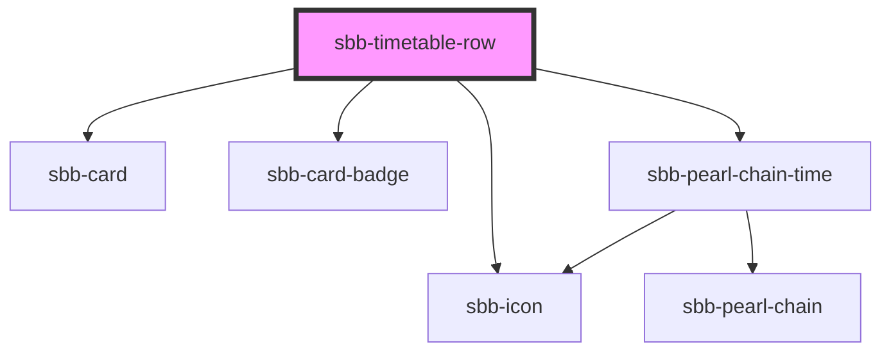

The `<sbb-timetable-row>` component displays a journey. The whole component is clickable and therefore emits a click-event. 
A Journey consists of various icons that display information about the means of transport, 
the occupancy in the first and second class, the most important warning for the trip and travel hints. 
Train changes are displayed in a pearl chain, which has the capability to show, 
if a connection is in the past, future or cancelled. 
In addition to that, the current position within the journey can be shown.

## Usage with props
Example props:  priceProp: {price:'12', text: 'CHF', isDiscount: true} <br>
                tripProp: {
                  legs: [
                    {
                      duration: 360,
                      id: 'test',
                      arrival: { time: '2022-08-40T15:00:00+02:00' },
                      departure: { time: '2022-04-30T15:00:00+02:00' },
                      serviceJourney: {
                        serviceAlteration: {
                          cancelled: false,
                        },
                      },
                    },
                  ],
                }

```html
<sbb-timetable-row disable-animation={false} loading-price={false} loading-trip={false} 
price={priceProp} trip={tripProp}></sbb-timetable-row>
```

## Testing

To specify a specific date for the current datetime, you can use the `data-now` attribute (timestamp in milliseconds).
This is helpful if you need a specific state of the component.

<!-- Auto Generated Below -->


## Properties

| Property           | Attribute           | Description                                                                                       | Type                                                                                                                                                            | Default     |
| ------------------ | ------------------- | ------------------------------------------------------------------------------------------------- | --------------------------------------------------------------------------------------------------------------------------------------------------------------- | ----------- |
| `active`           | `active`            | When this prop is true the sbb-card will be in the active state.                                  | `boolean`                                                                                                                                                       | `undefined` |
| `boarding`         | --                  | This will be forwarded to the notices section                                                     | `Boarding`                                                                                                                                                      | `undefined` |
| `disableAnimation` | `disable-animation` | This will be forwarded to the sbb-pearl-chain component - if true the position won't be animated. | `boolean`                                                                                                                                                       | `undefined` |
| `loadingPrice`     | `loading-price`     | The loading state - when this is true it will be render skeleton with an idling animation         | `boolean`                                                                                                                                                       | `undefined` |
| `loadingTrip`      | `loading-trip`      | The loading state - when this is true it will be render skeleton with an idling animation         | `boolean`                                                                                                                                                       | `undefined` |
| `price`            | --                  | The price Prop, which consists of the data for the badge.                                         | `Price`                                                                                                                                                         | `undefined` |
| `trip`             | --                  | The trip Prop                                                                                     | `{ __typename?: "Trip"; id: string; legs: Leg[]; notices: Notice[]; searchHint?: string[]; situations: PtSituation[]; summary?: TripSummary; valid: boolean; }` | `undefined` |


## Dependencies

### Depends on

- [sbb-card](../sbb-card)
- [sbb-card-badge](../sbb-card-badge)
- [sbb-icon](../sbb-icon)
- [sbb-pearl-chain-time](../sbb-pearl-chain-time)

### Graph


----------------------------------------------


