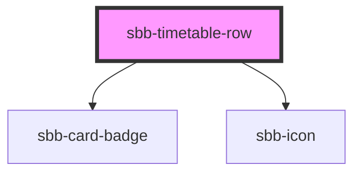

# sbb-timetable-row

<!-- Auto Generated Below -->

## Properties

| Property             | Attribute             | Description                                                                           | Type                                                                                                                        | Default     |
| -------------------- | --------------------- | ------------------------------------------------------------------------------------- | --------------------------------------------------------------------------------------------------------------------------- | ----------- |
| `accessibilityLabel` | `accessibility-label` | This will be forwarded as aria-label to the relevant element.                         | `string`                                                                                                                    | `undefined` |
| `config`             | --                    | config Prop - use this prop if slots are not prefered.                                | `{ price: string; notices?: Notice[]; situations?: PtSituation[]; summary: TripSummary; tripId: string; valid?: boolean; }` | `undefined` |
| `loading`            | `loading`             | loading state - when this is true it will be render skeleton with an idling animation | `boolean`                                                                                                                   | `false`     |

## Slots

| Slot                     | Description                                                                                                              |
| ------------------------ | ------------------------------------------------------------------------------------------------------------------------ |
| `"badge"`                | Slot used to render the sbb-card-badge component                                                                         |
| `"direction"`            | Slot used to render the direction text                                                                                   |
| `"duration"`             | Slot used to render the duration - recommandation: use `<time>` tag here                                                 |
| `"leftTime"`             | Slot used to render the departure time - recommandation: use `<time datetime="">` tag here                               |
| `"occupancyFirstClass"`  | Slot used to render the icon for the occupancy in the first class                                                        |
| `"occupancySecondClass"` | Slot used to render the icon for the occupancy in the second class                                                       |
| `"pearlChain"`           | Slot used to render the sbb-pearchain-chain component                                                                    |
| `"platform"`             | Slot used to render the platform                                                                                         |
| `"product"`              | Slot used to render the product category                                                                                 |
| `"rightTime"`            | Slot used to render the arrival time - recommandation: use `<time datetime="">` tag here                                 |
| `"transportNumber"`      | Slot used to render the icon for the transportation number - alternative: override with the `transportNumber` Prop       |
| `"travelHints"`          | Slot used to render the hint icons as a list                                                                             |
| `"walkTimeAfter"`        | Slot used to render the walk time - renders automaticly the walk-icon next to it - recommandation: use `<time>` tag here |
| `"walkTimeBefore"`       | Slot used to render the walk time - renders automaticly the walk-icon next to it - recommandation: use `<time>` tag here |
| `"warning"`              | Slot used to render a warning icon - CUS-HIM Icons                                                                       |

## Dependencies

### Depends on

- [sbb-card-badge](../sbb-card-badge)
- [sbb-icon](../sbb-icon)

### Graph

----------------------------------------------

