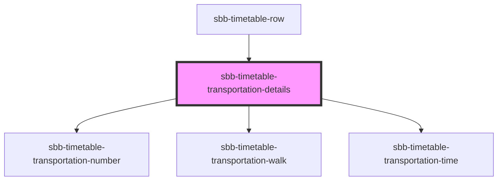

# sbb-timetable-transportation-details

!! Please note that this component is not intended for direct use. It will get used within sbb-timetable. It is listed
here to show the various configuration options to component developers. !!

<!-- Auto Generated Below -->

## Properties

| Property              | Attribute | Description                                                                                                                               | Type     | Default     |
| --------------------- | --------- | ----------------------------------------------------------------------------------------------------------------------------------------- | -------- | ----------- |
| `config` _(required)_ | `config`  | Stringified JSON which defines most of the content of the component. Please check the individual stories to get an idea of the structure. | `string` | `undefined` |

## Dependencies

### Used by

 - [sbb-timetable-row](../sbb-timetable-row)

### Depends on

- [sbb-timetable-transportation-number](../sbb-timetable-transportation-number)
- [sbb-timetable-transportation-walk](../sbb-timetable-transportation-walk)
- [sbb-timetable-transportation-time](../sbb-timetable-transportation-time)

### Graph

----------------------------------------------

