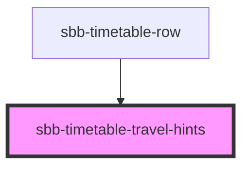

# sbb-timetable-travel-hints

!! Please note that this component is not intended for direct use. It will get used within sbb-timetable. It is listed
here to show the various configuration options to component developers. !!

<!-- Auto Generated Below -->

## Properties

| Property              | Attribute    | Description                                                                                                                               | Type                                        | Default              |
| --------------------- | ------------ | ----------------------------------------------------------------------------------------------------------------------------------------- | ------------------------------------------- | -------------------- |
| `appearance`          | `appearance` | Set the desired appearance of the component.                                                                                              | `"first-level-list" \| "second-level-list"` | `'first-level-list'` |
| `config` _(required)_ | `config`     | Stringified JSON which defines most of the content of the component. Please check the individual stories to get an idea of the structure. | `string`                                    | `undefined`          |

## Dependencies

### Used by

 - [sbb-timetable-row](../sbb-timetable-row)

### Graph

----------------------------------------------

