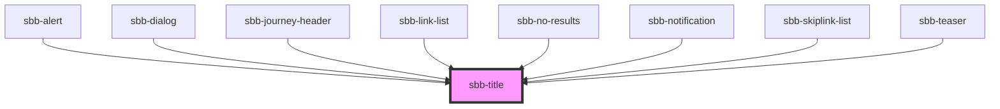

The component renders a title according to the provided `level`.
Internally this is represented by the heading elements: h1, h2, h3, h4, h5 and h6.
In scenarios where the visual representation needs to be different from the semantic meaning of the title level,
it is possible to use the `visual-level`.

As a default the `<sbb-title>` contains spacing on top and bottom on the host. This can be removed or customized
via simple CSS rules.

<!-- Auto Generated Below -->

## Properties

| Property         | Attribute         | Description                                                                                                                                                                                    | Type                                     | Default     |
| ---------------- | ----------------- | ---------------------------------------------------------------------------------------------------------------------------------------------------------------------------------------------- | ---------------------------------------- | ----------- |
| `level`          | `level`           | Title level                                                                                                                                                                                    | `"1" \| "2" \| "3" \| "4" \| "5" \| "6"` | `'1'`       |
| `negative`       | `negative`        | Choose negative variant                                                                                                                                                                        | `boolean`                                | `false`     |
| `visualLevel`    | `visual-level`    | Visual level for the title. Optional, if not set, the value of level will be used.                                                                                                             | `"1" \| "2" \| "3" \| "4" \| "5" \| "6"` | `undefined` |
| `visuallyHidden` | `visually-hidden` | Sometimes we need a title in the markup to present a proper hierarchy to the screen readers while we do not want to let that title appear visually. In this case we set visuallyHidden to true | `boolean`                                | `undefined` |

## Dependencies

### Used by

 - [sbb-alert](../sbb-alert)
 - [sbb-dialog](../sbb-dialog)
 - [sbb-journey-header](../sbb-journey-header)
 - [sbb-link-list](../sbb-link-list)
 - [sbb-no-results](../sbb-no-results)
 - [sbb-notification](../sbb-notification)
 - [sbb-skiplink-list](../sbb-skiplink-list)
 - [sbb-teaser](../sbb-teaser)

### Graph

----------------------------------------------

