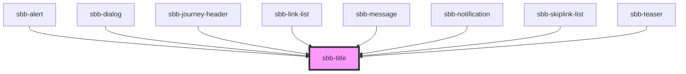

The `sbb-title` is a component which renders an heading element according to the provided `level` (default: `1`).

```html
<sbb-title>Hello</sbb-title>
```

In scenarios where the visual representation needs to be different from the semantic meaning of the title level,
it is possible to use the `visualLevel` property.
The available values for both `level` and `visualLevel` are the numbers from 1 to 6 (`h1` to `h6`).

```html
<sbb-title title='3' visual-level='4'>Hi!</sbb-title>
```

If the title is needed, but it must to not be displayed, it's possible to use the `visuallyHidden` property to hide it.

```html
<sbb-title visually-hidden>Screen-reader only.</sbb-title>
```

### Style

As a default the `sbb-title` contains spacing on top and bottom on the host. 
This can be removed or customized via simple CSS rules.

The component has a `negative` variant which can be set with the self-named property.

```html
<sbb-title negative>Negative</sbb-title>
```

<!-- Auto Generated Below -->


## Properties

| Property         | Attribute         | Description                                                                                                                                                                                    | Type                                     | Default     |
| ---------------- | ----------------- | ---------------------------------------------------------------------------------------------------------------------------------------------------------------------------------------------- | ---------------------------------------- | ----------- |
| `level`          | `level`           | Title level                                                                                                                                                                                    | `"1" \| "2" \| "3" \| "4" \| "5" \| "6"` | `'1'`       |
| `negative`       | `negative`        | Choose negative variant                                                                                                                                                                        | `boolean`                                | `false`     |
| `visualLevel`    | `visual-level`    | Visual level for the title. Optional, if not set, the value of level will be used.                                                                                                             | `"1" \| "2" \| "3" \| "4" \| "5" \| "6"` | `undefined` |
| `visuallyHidden` | `visually-hidden` | Sometimes we need a title in the markup to present a proper hierarchy to the screen readers while we do not want to let that title appear visually. In this case we set visuallyHidden to true | `boolean`                                | `undefined` |


## Dependencies

### Used by

 - [sbb-alert](../sbb-alert)
 - [sbb-dialog](../sbb-dialog)
 - [sbb-journey-header](../sbb-journey-header)
 - [sbb-link-list](../sbb-link-list)
 - [sbb-message](../sbb-message)
 - [sbb-notification](../sbb-notification)
 - [sbb-skiplink-list](../sbb-skiplink-list)
 - [sbb-teaser](../sbb-teaser)

### Graph


----------------------------------------------


