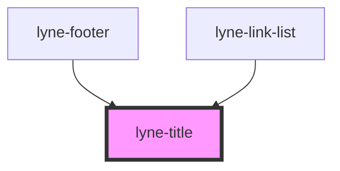

# lyne-title

<!-- Auto Generated Below -->

## Properties

| Property            | Attribute         | Description                                                                                                                                                                                            | Type                                     | Default      |
| ------------------- | ----------------- | ------------------------------------------------------------------------------------------------------------------------------------------------------------------------------------------------------ | ---------------------------------------- | ------------ |
| `level`             | `level`           | Title level                                                                                                                                                                                            | `"1" \| "2" \| "3" \| "4" \| "5" \| "6"` | `'1'`        |
| `text` _(required)_ | `text`            | Text for the title                                                                                                                                                                                     | `string`                                 | `undefined`  |
| `titleId`           | `title-id`        | A11y Tip: Sometimes we need to set an id, especially if we want to associate a relationship with another element through the use of aria-labelledby or aria-describedby or just offer an anchor target | `""`                                     | `undefined`  |
| `variant`           | `variant`         | Choose the title style variant                                                                                                                                                                         | `"negative" \| "positive"`               | `'positive'` |
| `visualLevel`       | `visual-level`    | Visual level for the title. If you don't define the visual-level, the value for level will be used.                                                                                                    | `"1" \| "2" \| "3" \| "4" \| "5" \| "6"` | `undefined`  |
| `visuallyHidden`    | `visually-hidden` | Sometimes we need a title in the markup to present a proper hierarchy to the screenreaders while we do not want to let that title appear visually. In this case we set visuallyHidden to true          | `boolean`                                | `undefined`  |

## Dependencies

### Used by

 - [lyne-footer](../lyne-footer)
 - [lyne-link-list](../lyne-link-list)

### Graph

----------------------------------------------

