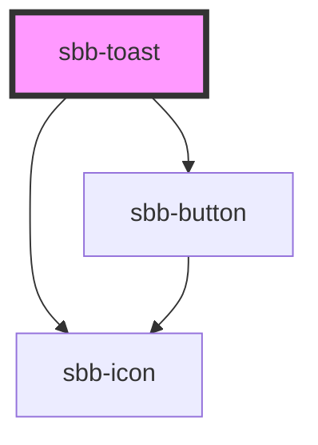

The `sbb-toast` is a component that can be used to display toast notifications.

## Usage
A `sbb-toast` can be shown/dismissed by calling the `open/close` methods.

Only one toast can ever be opened at one time. If a new toast is opened while a previous message is still showing, the older message will be automatically dismissed.

```html
<sbb-button onClick={() => document.querySelector('sbb-toast').open() } />

<sbb-toast position="bottom-left" timeout="6000" dismissible="true">
  Toast content
</sbb-toast>
```
A toast can also be given a custom action that, if marked with the `sbb-toast-close` attribute, will also dismiss it:

```html
<sbb-button onClick={() => document.querySelector('sbb-toast').open() } />

<sbb-toast position="bottom-left">
  Toast content

  <!-- Toast action can be a button -->
  <sbb-button slot="action" icon-name="clock-small" sbb-toast-close></sbb-button>
  <!-- Or a link -->
  <sbb-link slot="action">Link action</sbb-link>
</sbb-toast>
```

## Accessibility
`sbb-toast` announces messages via an aria-live region. Use the `politeness` property to customize the politeness announcement behaviour. 
Check [ARIA live regions](https://developer.mozilla.org/en-US/docs/Web/Accessibility/ARIA/ARIA_Live_Regions#live_regions) for further info.

`sbb-toast` does not move focus to the toast element. Moving focus like this would disrupt users in the middle of a workflow. 

For any action offered in the toast, your application should provide an alternative way to perform the action (e.g. a keyaboard combination).

Avoid setting a `duration` for toasts that have an action available, as screen reader users may want to navigate to the toast element to activate the action.

### Known issue
Slotted text is not interpreted correctly by screen readers on Chrome. To address the problem, the component will automatically wrap any slotted text in a `span` element. Unless strictly necessary, we advise you not to wrap it preventively and let the component do it for you.

```html
<sbb-toast position="bottom-left">
  <!-- This text would not be read on Chrome -->
  Free text node
</sbb-toast>

<sbb-toast position="bottom-left">
  <span> Toast content </span> <!-- This is OK! -->
</sbb-toast>
```

<!-- Auto Generated Below -->


## Properties

| Property           | Attribute           | Description                                                                                                                                      | Type                                                                                                                                                            | Default           |
| ------------------ | ------------------- | ------------------------------------------------------------------------------------------------------------------------------------------------ | --------------------------------------------------------------------------------------------------------------------------------------------------------------- | ----------------- |
| `disableAnimation` | `disable-animation` | Whether the animation is disabled.                                                                                                               | `boolean`                                                                                                                                                       | `false`           |
| `dismissible`      | `dismissible`       | Whether the toast has a close button.                                                                                                            | `boolean`                                                                                                                                                       | `false`           |
| `iconName`         | `icon-name`         | The name of the icon, choose from the small icon variants from the ui-icons category from here https://icons.app.sbb.ch.                         | `string`                                                                                                                                                        | `undefined`       |
| `politeness`       | `politeness`        | The ARIA politeness level. Check https://developer.mozilla.org/en-US/docs/Web/Accessibility/ARIA/ARIA_Live_Regions#live_regions for further info | `"assertive" \| "off" \| "polite"`                                                                                                                              | `'assertive'`     |
| `position`         | `position`          | The position where to place the toast.                                                                                                           | `"bottom-center" \| "bottom-end" \| "bottom-left" \| "bottom-right" \| "bottom-start" \| "top-center" \| "top-end" \| "top-left" \| "top-right" \| "top-start"` | `'bottom-center'` |
| `timeout`          | `timeout`           | The length of time in milliseconds to wait before automatically dismissing the toast. If 0, it stays open indefinitely.                          | `number`                                                                                                                                                        | `6000`            |


## Events

| Event        | Description                                                    | Type                |
| ------------ | -------------------------------------------------------------- | ------------------- |
| `did-close`  | Emits whenever the autocomplete is closed.                     | `CustomEvent<void>` |
| `did-open`   | Emits whenever the autocomplete is opened.                     | `CustomEvent<void>` |
| `will-close` | Emits whenever the autocomplete begins the closing transition. | `CustomEvent<void>` |
| `will-open`  | Emits whenever the autocomplete starts the opening transition. | `CustomEvent<void>` |


## Methods

### `close() => Promise<void>`

Close the toast.

#### Returns

Type: `Promise<void>`


### `open() => Promise<void>`

Open the toast.
If there are other opened toasts in the page, close them first.

#### Returns

Type: `Promise<void>`


## Slots

| Slot        | Description                  |
| ----------- | ---------------------------- |
| `"unnamed"` | Use this to document a slot. |


## Dependencies

### Depends on

- [sbb-icon](../sbb-icon)
- [sbb-button](../sbb-button)

### Graph


----------------------------------------------


