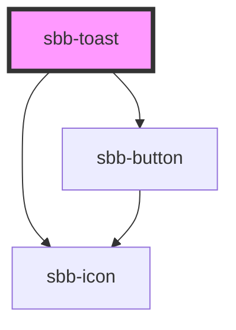

to be documented...

<!-- Auto Generated Below -->

## Properties

| Property           | Attribute           | Description                                                                                                                               | Type                                                                                              | Default           |
| ------------------ | ------------------- | ----------------------------------------------------------------------------------------------------------------------------------------- | ------------------------------------------------------------------------------------------------- | ----------------- |
| `disableAnimation` | `disable-animation` | Whether the animation is disabled.                                                                                                        | `boolean`                                                                                         | `false`           |
| `dismissible`      | `dismissible`       | Whether the toast has a close button.                                                                                                     | `boolean`                                                                                         | `false`           |
| `iconName`         | `icon-name`         | The icon name we want to use, choose from the small icon variants from the ui-icons category from here https://lyne.sbb.ch/tokens/icons/. | `string`                                                                                          | `undefined`       |
| `politeness`       | `politeness`        | TODO: Check https://developer.mozilla.org/en-US/docs/Web/Accessibility/ARIA/ARIA_Live_Regions#live_regions for further info               | `"assertive" \| "off" \| "polite"`                                                                | `undefined`       |
| `position`         | `position`          |                                                                                                                                           | `"bottom-center" \| "bottom-left" \| "bottom-right" \| "top-center" \| "top-left" \| "top-right"` | `'bottom-center'` |
| `timeout`          | `timeout`           | TODO                                                                                                                                      | `number`                                                                                          | `3000`            |

## Events

| Event        | Description                                                    | Type                |
| ------------ | -------------------------------------------------------------- | ------------------- |
| `did-close`  | Emits whenever the autocomplete is closed.                     | `CustomEvent<void>` |
| `did-open`   | Emits whenever the autocomplete is opened.                     | `CustomEvent<void>` |
| `will-close` | Emits whenever the autocomplete begins the closing transition. | `CustomEvent<void>` |
| `will-open`  | Emits whenever the autocomplete starts the opening transition. | `CustomEvent<void>` |

## Methods

### `close() => Promise<void>`

Close the toast.

#### Returns

Type: `Promise<void>`

### `getState() => Promise<SbbOverlayState>`

#### Returns

Type: `Promise<SbbOverlayState>`

### `open() => Promise<void>`

Open the toast.
If there are other opened toasts in the page, close them first.

#### Returns

Type: `Promise<void>`

## Slots

| Slot        | Description                  |
| ----------- | ---------------------------- |
| `"unnamed"` | Use this to document a slot. |

## Dependencies

### Depends on

- [sbb-icon](../sbb-icon)
- [sbb-button](../sbb-button)

### Graph

----------------------------------------------

