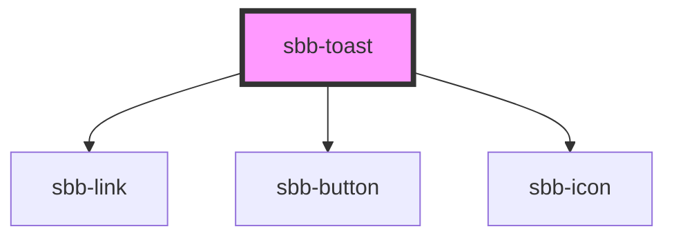

# sbb-toast

A toast is a non-disruptive notification message that appears in the page for a limited time, as a feedback on the outcome of an action, or to display a system message.

### Configuration

The toast configuration must be set using the  `InterfaceToastConfiguration` interface.

###### message
Mandatory: the message that will be displayed. Long messages use multiple lines (no ellipsis).
  Default: `null`.
###### timeout
Optional: how long (in ms) the toast will be displayed. If 0, it will never be dismissed.
  Default: `6000`.
###### icon
TBD waiting for sbb-icon
###### iconTemplate
TBD waiting for sbb-icon
###### action
Optional: the toast can display an action item.
- Link button (see `InterfaceToastLink`): on click, the defined page will be open in a new tab, then the toast will be dismissed. 
- Action button (see `InterfaceToastAction`): on click, the defined callback will be executed, then the toast will be dismissed.
- Close icon (see `InterfaceToastIcon`): on click, the toast will be dismissed. 
###### verticalPosition
Optional: the toast vertical position on screen.
  Default: `start`.
  Options: `start` - `end`.
###### horizontalPosition
Optional: the toast horizontal position on screen.
  Default: `center`.
  Options: `start` - `end` - `center`;
###### ariaLivePoliteness
Optional: value for the `aria-live` attribute
  Default: `polite`.
  Options: `polite` - `assertive` - `off`.

### Animations
The toast have defaults animations for show and hide. They can be overriden using the properties `enterAnimation` and `leaveAnimation`.

###Accessibility
As mentioned, the `aria-live` can be configured using the ariaLivePoliteness parameter in the config object. The `aria-atomic` is always set to true, while the `role` is set to `status` if there is no action, otherwise to `dialog`.
 
The `role` for the action button is `cancel` for the close icon, while can be set by consumers in the other cases and it's returned in the dismiss events. 
 
Toasts don't take focus. 

<!-- Auto Generated Below -->

## Properties

| Property           | Attribute           | Description                                                                              | Type                                              | Default     |
| ------------------ | ------------------- | ---------------------------------------------------------------------------------------- | ------------------------------------------------- | ----------- |
| `config`           | --                  | Exposed toast configuration.                                                             | `InterfaceToastConfiguration`                     | `undefined` |
| `disableAnimation` | `disable-animation` | Indicates whether the toast will play enter-leave animations.                            | `boolean`                                         | `false`     |
| `enterAnimation`   | --                  | The animation used when the toast is presented.                                          | `(baseEl: any, opts?: any) => InterfaceAnimation` | `undefined` |
| `keyboardClose`    | `keyboard-close`    | Indicates whether the keyboard is automatically dismissed when the overlay is presented. | `boolean`                                         | `false`     |
| `leaveAnimation`   | --                  | The animation used when the toast is dismissed.                                          | `(baseEl: any, opts?: any) => InterfaceAnimation` | `undefined` |

## Events

| Event                    | Description                             | Type                                            |
| ------------------------ | --------------------------------------- | ----------------------------------------------- |
| `sbb-toast_did-dismiss`  | Emitted after the toast has dismissed.  | `CustomEvent<InterfaceOverlayEventDetail<any>>` |
| `sbb-toast_did-present`  | Emitted after the toast has presented.  | `CustomEvent<void>`                             |
| `sbb-toast_will-dismiss` | Emitted before the toast has dismissed. | `CustomEvent<InterfaceOverlayEventDetail<any>>` |
| `sbb-toast_will-present` | Emitted before the toast has presented. | `CustomEvent<void>`                             |

## Methods

### `dismiss(data?: any, role?: string) => Promise<boolean>`

Dismiss the toast overlay after it has been presented.

#### Returns

Type: `Promise<boolean>`

### `onDidDismiss<T = any>() => Promise<InterfaceOverlayEventDetail<T>>`

Returns a promise that resolves when the toast did dismiss.

#### Returns

Type: `Promise<InterfaceOverlayEventDetail<T>>`

### `onWillDismiss<T = any>() => Promise<InterfaceOverlayEventDetail<T>>`

Returns a promise that resolves when the toast will dismiss.

#### Returns

Type: `Promise<InterfaceOverlayEventDetail<T>>`

### `present() => Promise<void>`

Present the toast overlay after it has been created.

#### Returns

Type: `Promise<void>`

## Dependencies

### Depends on

- [sbb-link](../sbb-link)
- [sbb-button](../sbb-button)
- [sbb-icon](../sbb-icon)

### Graph

----------------------------------------------

