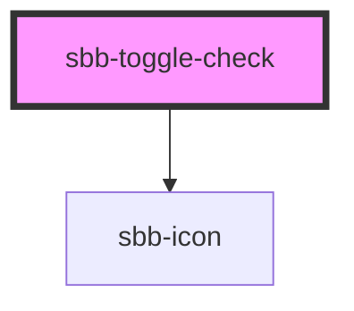

# sbb-toggle-check

`<sbb-toggle-check>` provides the same functionality as a native `<input type="checkbox">`
enhanced with the SBB Design.

Consumers can listen to the native `change` event on the `sbb-toggle-check` component to intercept the input's change;
the current state can be read from `event.target.checked` and the value from `event.target.value`.

```html
<sbb-toggle-check
  value="single-checkbox"
  disabled="false"
  checked="false"
>
  Example
</sbb-toggle-check>
```

## Label

The label is provided as the content to the `<sbb-toggle-check>` element.
It can be displayed after or before the toggle-check.

If you don't want the label to appear next to the toggle-check, you can use
`accessibility-label` (forwarded as [`aria-label`](https://www.w3.org/TR/WCAG20-TECHS/ARIA14.html)) or
`accessibility-labelledby` (forwarded as [`aria-labelledby`](https://www.w3.org/TR/WCAG20-TECHS/ARIA16.html)) to
specify an appropriate label.

## Accessibility

`SbbToggleCheck` uses an internal `<input type="checkbox">` to provide an accessible experience.
This internal checkbox receives focus and is automatically labelled by the text content of the
`<sbb-toggle-check>` element. Avoid adding other interactive controls into the content of
`<sbb-toggle-check>`, as this degrades the experience for users of assistive technology.

Always provide an accessible label via `accessibility-label` or `accessibility-labelledby` for checkboxes without
descriptive text content.

Additionally, you can use `accessibility-describedby` (forwarded as [`aria-describedby`](https://www.w3.org/TR/WCAG20-TECHS/ARIA1.html))
to describe the element on which the attribute is set.

```html
<sbb-toggle-check accessibility-label="Subscribed to email message" />
```

<!-- Auto Generated Below -->


## Properties

| Property                   | Attribute                   | Description                                                              | Type                  | Default                             |
| -------------------------- | --------------------------- | ------------------------------------------------------------------------ | --------------------- | ----------------------------------- |
| `accessibilityDescribedby` | `accessibility-describedby` | The aria-describedby prop for the hidden input.                          | `string`              | `undefined`                         |
| `accessibilityLabel`       | `accessibility-label`       | The aria-label prop for the hidden input.                                | `string`              | `undefined`                         |
| `accessibilityLabelledby`  | `accessibility-labelledby`  | The aria-labelledby prop for the hidden input.                           | `string`              | `undefined`                         |
| `checked`                  | `checked`                   | Whether the toggle-check is checked.                                     | `boolean`             | `false`                             |
| `disabled`                 | `disabled`                  | The disabled prop for the disabled state.                                | `boolean`             | `false`                             |
| `icon`                     | `icon`                      | The svg name for the true state - default -> 'tick-small'                | `string`              | `'tick-small'`                      |
| `inputId`                  | `input-id`                  | Id of the internal input element - default id will be set automatically. | `string`              | ``sbb-toggle-checkbox-${++nextId}`` |
| `labelPosition`            | `label-position`            | The label position relative to the toggle. Defaults to 'after'           | `"after" \| "before"` | `'after'`                           |
| `name`                     | `name`                      | Name of the toggle-check.                                                | `string`              | `undefined`                         |
| `required`                 | `required`                  | The required prop for the required state.                                | `boolean`             | `false`                             |
| `value`                    | `value`                     | Value of toggle-check.                                                   | `string`              | `undefined`                         |


## Events

| Event       | Description                                                                                                                         | Type               |
| ----------- | ----------------------------------------------------------------------------------------------------------------------------------- | ------------------ |
| `didChange` | <span style="color:red">**[DEPRECATED]**</span> only used for React. Will probably be removed once React 19 is available.<br/><br/> | `CustomEvent<any>` |


## Dependencies

### Depends on

- [sbb-icon](../sbb-icon)

### Graph


----------------------------------------------


