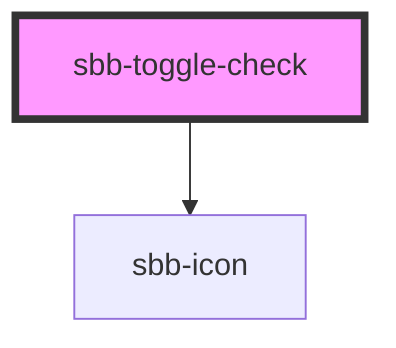

The `sbb-toggle-check` is a component which provides the same functionality as a native `<input type="checkbox"/>`
enhanced with the SBB Design.

```html
<sbb-toggle-check value="single-checkbox">Example</sbb-toggle-check>
```

### Slots

It is possible to provide a label via an unnamed slot; the component can optionally display a `sbb-icon`
using the `iconName` property or via custom content using the `icon` slot. 
The icon can be at the component start or end based on the value of the `labelPosition` property (default: `after`).

```html
<sbb-toggle-check value="single-checkbox" icon-name='pie-small'>
  Example
</sbb-toggle-check>

<sbb-toggle-check value="single-checkbox" icon-name='pie-small' label-position='start'>
  Another example
</sbb-toggle-check>
```

### States

The component can be displayed in `checked` or `disabled` states using the self-named properties.

```html
<sbb-toggle-check value="Value" checked>Option</sbb-toggle-check>

<sbb-toggle-check value="Value" disabled>Option</sbb-toggle-check>
```

### Events

Consumers can listen to the native `change` event on the `sbb-toggle-check` component to intercept the input's change;
the current state can be read from `event.target.checked` and the value from `event.target.value`.

## Accessibility

The `sbb-toggle-check` component uses an internal `<input type="checkbox"/>` to provide an accessible experience.
This internal checkbox receives focus and is automatically labelled by the text content of the `sbb-toggle-check` element. 
Avoid adding other interactive controls into the content of `sbb-toggle-check`, as this degrades the experience for users of assistive technology.

If you don't want the label to appear next to the `sbb-toggle-check` component,
you can not provide it and then use `aria-label` to specify an appropriate label for screen-readers.

```html
<sbb-toggle-check aria-label="Subscribed to email message" />
```

<!-- Auto Generated Below -->


## Properties

| Property        | Attribute        | Description                                                    | Type                  | Default        |
| --------------- | ---------------- | -------------------------------------------------------------- | --------------------- | -------------- |
| `checked`       | `checked`        | Whether the toggle-check is checked.                           | `boolean`             | `false`        |
| `disabled`      | `disabled`       | The disabled prop for the disabled state.                      | `boolean`             | `false`        |
| `iconName`      | `icon-name`      | The svg name for the true state - default -> 'tick-small'      | `string`              | `'tick-small'` |
| `labelPosition` | `label-position` | The label position relative to the toggle. Defaults to 'after' | `"after" \| "before"` | `'after'`      |
| `name`          | `name`           | Name of the toggle-check.                                      | `string`              | `undefined`    |
| `required`      | `required`       | The required prop for the required state.                      | `boolean`             | `false`        |
| `size`          | `size`           | Size variant, either m or s.                                   | `"m" \| "s"`          | `'s'`          |
| `value`         | `value`          | Value of toggle-check.                                         | `string`              | `undefined`    |


## Events

| Event       | Description                                                                                                                         | Type               |
| ----------- | ----------------------------------------------------------------------------------------------------------------------------------- | ------------------ |
| `didChange` | <span style="color:red">**[DEPRECATED]**</span> only used for React. Will probably be removed once React 19 is available.<br/><br/> | `CustomEvent<any>` |


## Slots

| Slot        | Description                                                                       |
| ----------- | --------------------------------------------------------------------------------- |
| `"icon"`    | Use this slot to provide an icon. If `icon-name` is set, a sbb-icon will be used. |
| `"unnamed"` | Use this slot to provide the toggle label.                                        |


## Dependencies

### Depends on

- [sbb-icon](../sbb-icon)

### Graph


----------------------------------------------


