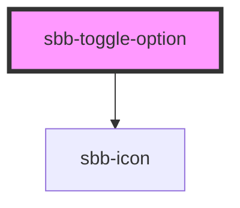

# sbb-toggle-option

<!-- Auto Generated Below -->

## Properties

| Property         | Attribute          | Description                                                              | Type      | Default                           |
| ---------------- | ------------------ | ------------------------------------------------------------------------ | --------- | --------------------------------- |
| `checked`        | `checked`          | Whether the toggle-option is checked.                                    | `boolean` | `false`                           |
| `disabled`       | `disabled`         | Whether the toggle option is disabled.                                   | `boolean` | `false`                           |
| `iconName`       | `icon-name`        | Name of the icon for `<sbb-icon>`.                                       | `string`  | `undefined`                       |
| `name`           | `name`             | Name of the toggle-option.                                               | `string`  | `undefined`                       |
| `toggleOptionId` | `toggle-option-id` | Id of the internal input element - default id will be set automatically. | `string`  | ``sbb-toggle-option-${++nextId}`` |
| `value`          | `value`            | Value of toggle-option.                                                  | `string`  | `undefined`                       |

## Events

| Event        | Description                                     | Type               |
| ------------ | ----------------------------------------------- | ------------------ |
| `did-select` | Emits whenever the toggle-option value changes. | `CustomEvent<any>` |

## Methods

### `select() => Promise<void>`

#### Returns

Type: `Promise<void>`

## Slots

| Slot        | Description                                           |
| ----------- | ----------------------------------------------------- |
| `"icon"`    | Slot used to render the `<sbb-icon>`.                 |
| `"unnamed"` | Slot used to render the content inside the component. |

## Dependencies

### Depends on

- [sbb-icon](../sbb-icon)

### Graph

----------------------------------------------

