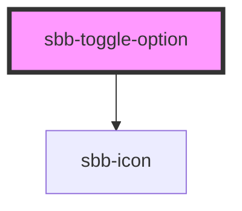

The `sbb-toggle-option` component is used inside the 
[sbb-toggle](/docs/components-sbb-toggle-sbb-toggle--docs) in order to render the toggle's options. 

```html
<sbb-toggle-option value="Value">Option</sbb-toggle-option>
```

### Slots

It is possible to provide a label via an unnamed slot; the component can optionally display a `sbb-icon`
at the component start using the `iconName` property or via custom content using the `icon` slot.
Text and icon are not exclusive and can be used together.

```html
<sbb-toggle-option value="Value" icon-name="app-icon-small"></sbb-toggle-option>

<sbb-toggle-option value="Value" icon-name="app-icon-small">Option</sbb-toggle-option>
```

### States

The component can be displayed in `checked` or `disabled` states using the self-named properties.

```html
<sbb-toggle-option value="Value" checked>Option</sbb-toggle-option>

<sbb-toggle-option value="Value" disabled>Option</sbb-toggle-option>
```

<!-- Auto Generated Below -->


## Properties

| Property   | Attribute   | Description                            | Type      | Default     |
| ---------- | ----------- | -------------------------------------- | --------- | ----------- |
| `checked`  | `checked`   | Whether the toggle-option is checked.  | `boolean` | `false`     |
| `disabled` | `disabled`  | Whether the toggle option is disabled. | `boolean` | `false`     |
| `iconName` | `icon-name` | Name of the icon for `<sbb-icon>`.     | `string`  | `undefined` |
| `value`    | `value`     | Value of toggle-option.                | `string`  | `undefined` |


## Events

| Event          | Description                                                                                                 | Type                                                                          |
| -------------- | ----------------------------------------------------------------------------------------------------------- | ----------------------------------------------------------------------------- |
| `state-change` | Internal event that emits whenever the state of the toggle option in relation to the parent toggle changes. | `CustomEvent<ToggleOptionStateChangeChecked \| ToggleOptionStateChangeValue>` |


## Slots

| Slot        | Description                                         |
| ----------- | --------------------------------------------------- |
| `"icon"`    | Slot used to render the `<sbb-icon>`.               |
| `"unnamed"` | Slot used to render the label of the toggle option. |


## Dependencies

### Depends on

- [sbb-icon](../sbb-icon)

### Graph


----------------------------------------------


