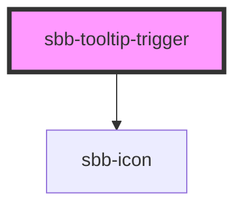

# sbb-tooltip-trigger
The `sbb-tooltip-trigger` component is used to trigger a tooltip by pressing a button. By default is rendered a `sbb-icon`. It is possible to override the `sbb-icon` with custom contents.

## Usage

The examples below shows how to use the component with the `<sbb-icon>` and custom content.
 
 ```html
 <sbb-tooltip-trigger id="tooltip-trigger"></sbb-tooltip-trigger>

<sbb-tooltip trigger="tooltip-trigger">
  <p>
    Tooltip content. 
  </p>
</sbb-tooltip>

<sbb-tooltip-trigger id="tooltip-trigger2">
  Custom Content
</sbb-tooltip-trigger>

<sbb-tooltip trigger="tooltip-trigger2">
  <p>
    Tooltip content. 
  </p>
</sbb-tooltip>
 ```

<!-- Auto Generated Below -->


## Properties

| Property   | Attribute   | Description                                                                                                                               | Type     | Default                      |
| ---------- | ----------- | ----------------------------------------------------------------------------------------------------------------------------------------- | -------- | ---------------------------- |
| `iconName` | `icon-name` | The icon name we want to use, choose from the small icon variants from the ui-icons category from here https://lyne.sbb.ch/tokens/icons/. | `string` | `'circle-information-small'` |


## Slots

| Slot        | Description                 |
| ----------- | --------------------------- |
| `"unnamed"` | Slot to render the content. |


## Dependencies

### Depends on

- [sbb-icon](../sbb-icon)

### Graph


----------------------------------------------


