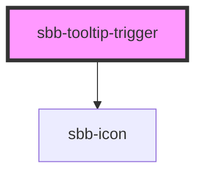

# sbb-tooltip-trigger

<!-- Auto Generated Below -->

## Properties

| Property   | Attribute   | Description | Type     | Default                      |
| ---------- | ----------- | ----------- | -------- | ---------------------------- |
| `iconName` | `icon-name` |             | `string` | `'circle-information-small'` |
| `id`       | `id`        |             | `string` | `undefined`                  |

## Slots

| Slot        | Description                  |
| ----------- | ---------------------------- |
| `"unnamed"` | Use this to document a slot. |

## Dependencies

### Depends on

- [sbb-icon](../sbb-icon)

### Graph

----------------------------------------------

