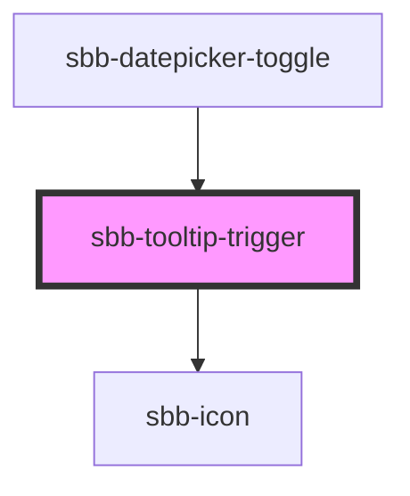

# sbb-tooltip-trigger

The `sbb-tooltip-trigger` component is used to trigger a tooltip by pressing a button. 
By default, it renders the `sbb-icon` `information-circle-small`; with the property `icon-name` it is possible to define a custom icon. 
Moreover, it is possible to override the `sbb-icon` with custom content by slotting it.

## Usage

The examples below shows how to use the component with the `<sbb-icon>` and custom content.
 
### Tooltip trigger with sbb-icon
```html
 <sbb-tooltip-trigger id="tooltip-trigger"></sbb-tooltip-trigger>

<sbb-tooltip trigger="tooltip-trigger">
  <p>
    Tooltip content. 
  </p>
</sbb-tooltip>
```

### Tooltip trigger with custom content
```html
<sbb-tooltip-trigger id="tooltip-trigger2">
  Custom Content
</sbb-tooltip-trigger>

<sbb-tooltip trigger="tooltip-trigger2">
  <p>
    Tooltip content. 
  </p>
</sbb-tooltip>
```

### Accessibility
In order to make screen readers announce the type of the trigger when is focused, use the `aria-label` attribute, as shown below:

```html
<sbb-tooltip-trigger aria-label="Custom label" id="tooltip-trigger">
</sbb-tooltip-trigger>
```

To make screen readers announce the tooltip content when the trigger is focused, 
associate the tooltip trigger with the tooltip via `aria-describedby` and an `id`.

```html
<sbb-tooltip-trigger aria-describedby="tooltip-content" id="tooltip-trigger"></sbb-tooltip-trigger>

<!-- Tooltip component -->
<sbb-tooltip id="tooltip" trigger="tooltip-trigger">
    <p id="tooltip-content">
      Tooltip content. <sbb-link id="tooltip-link" variant="inline">Link</sbb-link>
    </p>
</sbb-tooltip>
```

<!-- Auto Generated Below -->


## Properties

| Property   | Attribute   | Description                                                                                                                               | Type      | Default                      |
| ---------- | ----------- | ----------------------------------------------------------------------------------------------------------------------------------------- | --------- | ---------------------------- |
| `disabled` | `disabled`  | Whether the tooltip-trigger is disabled.                                                                                                  | `boolean` | `false`                      |
| `iconName` | `icon-name` | The icon name we want to use, choose from the small icon variants from the ui-icons category from here https://lyne.sbb.ch/tokens/icons/. | `string`  | `'circle-information-small'` |
| `name`     | `name`      | The name attribute to use for the button.                                                                                                 | `string`  | `undefined`                  |


## Slots

| Slot        | Description                 |
| ----------- | --------------------------- |
| `"unnamed"` | Slot to render the content. |


## Dependencies

### Used by

 - [sbb-datepicker-toggle](../sbb-datepicker-toggle)

### Depends on

- [sbb-icon](../sbb-icon)

### Graph


----------------------------------------------


