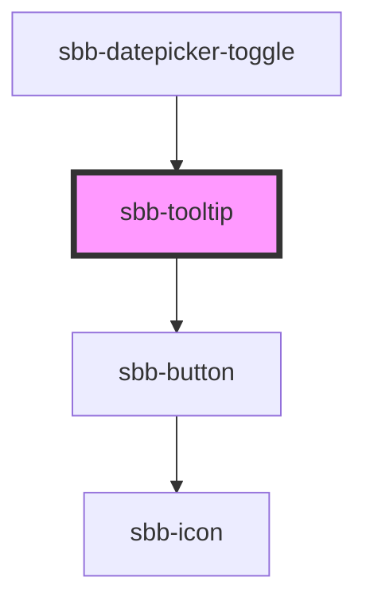

The `sbb-tooltip` component can be useful for displaying contextual and additional information on mouse hover or click of a trigger element. 

The component could be used:

- to describe icons and buttons;
- when more information is useful to help a user make decisions;
- when an element needs more context or explanation;
- when defining a term or inline item.

The component must be connected with the trigger element using the `trigger` property,
which accepts the id of the element, or directly its reference;
the [sbb-tooltip-trigger](/docs/components-sbb-tooltip-sbb-tooltip-trigger--docs) is meant to be used as trigger.

```html
<sbb-tooltip-trigger id="tooltip-trigger"></sbb-tooltip-trigger>

<sbb-tooltip id="tooltip" trigger="tooltip-trigger">
  <p id="tooltip-content">Tooltip content.</p>
</sbb-tooltip>
```

## Interactions

The `sbb-tooltip` can be dismissed by clicking on an interactive element within its content, 
by clicking on the close button or by performing another action on the page.

You can also indicate that an element within the tooltip content should close the `sbb-tooltip` when clicked 
by marking it with the `sbb-tooltip-close` attribute; 
it's also possible to hide the default close button using the `hideCloseButton` property.

```html
<sbb-tooltip-trigger id="tooltip-trigger"></sbb-tooltip-trigger>

<sbb-tooltip id="tooltip" trigger="tooltip-trigger" hide-close-button>
  <p id="tooltip-content">
    Tooltip content. <sbb-link id="tooltip-link" variant="inline" sbb-tooltip-close>Link</sbb-link>
  </p>
</sbb-tooltip>
```

You can also indicate that the `sbb-tooltip` should be shown on hover with the property `hoverTrigger`
and set a custom delay for the open and close animations (defaults to 0). 
In this case, the default close button is hidden.

If hover is not supported by the current device, the component will be triggered on click/tap as default.
The `sbb-tooltip` will automatically disappear after the hiding delay 
if neither the trigger element nor the tooltip are on hover or if another action is performed on the page.

```html
<sbb-tooltip-trigger id="tooltip-trigger"></sbb-tooltip-trigger>

<sbb-tooltip id="tooltip" trigger="tooltip-trigger" hover-trigger open-delay="500" close-delay="750">
  <p id="tooltip-content">
    Tooltip content. <sbb-link id="tooltip-link" variant="inline">Link</sbb-link>
  </p>
</sbb-tooltip>
```

## Style

The `sbb-tooltip` automatically calculates where it should place itself, based on available space. Default is below and center.
The default `z-index` of the component is set to `1000`;
to specify a custom stack order, the `z-index` can be changed by defining the CSS variable `--sbb-tooltip-z-index`.

## Accessibility

As the tooltip opens, the focus will automatically be set to the first focusable item within the component.

To make screen-readers announce the tooltip content when the trigger is focused, 
associate the trigger with the `sbb-tooltip` via `aria-describedby` and `id` as shown below. 

If the tooltip trigger is a `sbb-tooltip-trigger` component, set `role="button"` on it, 
since the `aria-describedby` attribute can be used with semantic HTML elements and with elements 
that have an ARIA `role`.

```html
<!-- Trigger element -->
<button id="tooltip-trigger" aria-describedby="tooltip-content">Button with tooltip</button>

<!-- Tooltip component -->
<sbb-tooltip id="tooltip" trigger="tooltip-trigger">
    <p id="tooltip-content">
      Tooltip content. <sbb-link id="tooltip-link" variant="inline">Link</sbb-link>
    </p>
</sbb-tooltip>

<!-- Tooltip trigger component -->
<sbb-tooltip-trigger role="button" aria-describedby="tooltip-content" id="tooltip-trigger"></sbb-tooltip-trigger>

<!-- Tooltip component -->
<sbb-tooltip id="tooltip" trigger="tooltip-trigger">
    <p id="tooltip-content">
      Tooltip content. <sbb-link id="tooltip-link" variant="inline">Link</sbb-link>
    </p>
</sbb-tooltip>
```

<!-- Auto Generated Below -->


## Properties

| Property                  | Attribute                   | Description                                                                                                     | Type                    | Default     |
| ------------------------- | --------------------------- | --------------------------------------------------------------------------------------------------------------- | ----------------------- | ----------- |
| `accessibilityCloseLabel` | `accessibility-close-label` | This will be forwarded as aria-label to the close button element.                                               | `string`                | `undefined` |
| `closeDelay`              | `close-delay`               | Close the tooltip after a certain delay.                                                                        | `number`                | `0`         |
| `disableAnimation`        | `disable-animation`         | Whether the animation is enabled.                                                                               | `boolean`               | `false`     |
| `hideCloseButton`         | `hide-close-button`         | Whether the close button should be hidden.                                                                      | `boolean`               | `false`     |
| `hoverTrigger`            | `hover-trigger`             | Whether the tooltip should be triggered on hover.                                                               | `boolean`               | `false`     |
| `openDelay`               | `open-delay`                | Open the tooltip after a certain delay.                                                                         | `number`                | `0`         |
| `trigger`                 | `trigger`                   | The element that will trigger the tooltip overlay. Accepts both a string (id of an element) or an HTML element. | `HTMLElement \| string` | `undefined` |


## Events

| Event        | Description                                               | Type                                         |
| ------------ | --------------------------------------------------------- | -------------------------------------------- |
| `did-close`  | Emits whenever the tooltip is closed.                     | `CustomEvent<{ closeTarget: HTMLElement; }>` |
| `did-open`   | Emits whenever the tooltip is opened.                     | `CustomEvent<void>`                          |
| `will-close` | Emits whenever the tooltip begins the closing transition. | `CustomEvent<{ closeTarget: HTMLElement; }>` |
| `will-open`  | Emits whenever the tooltip starts the opening transition. | `CustomEvent<void>`                          |


## Methods

### `close(target?: HTMLElement) => Promise<void>`

Closes the tooltip.

#### Returns

Type: `Promise<void>`


### `open() => Promise<void>`

Opens the tooltip on trigger click.

#### Returns

Type: `Promise<void>`


## Slots

| Slot        | Description                                              |
| ----------- | -------------------------------------------------------- |
| `"unnamed"` | Use this slot to project any content inside the tooltip. |


## Dependencies

### Used by

 - [sbb-datepicker-toggle](../sbb-datepicker-toggle)

### Depends on

- [sbb-button](../sbb-button)

### Graph


----------------------------------------------


