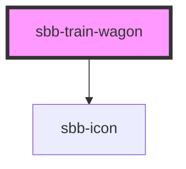

THe `sbb-train-wagon` is a component which represents a train compartment. 

It is used inside the [sbb-train](/docs/timetable-sbb-train--docs) element. 

### Variants

The component can visualize a locomotive or a wagon (possibly closed), 
so it has three different variants, based on the value of the `type` property.

```html
<sbb-train-wagon type="wagon"></sbb-train-wagon>

<sbb-train-wagon type="locomotive"></sbb-train-wagon>

<sbb-train-wagon type="closed"></sbb-train-wagon>
```

The property `occupancy` sets the component's inner icon; available values are `high`, `medium`, `low` and `unknown`;
it's also possible to display the wagon class at component's end using the `wagonClass` property 
and a `label` above the component with the self-named property.

```html
<sbb-train-wagon type="wagon" label="38" occupancy="low" wagon-class="1"></sbb-train-wagon>
```

**Note:**
A `sbb-train-wagon` with `type="wagon"` has the possibilities of slotting icons. 
They will be applied internally into a list (using `<ul>` and `<li>`) and requires an `aria-label` for each slotted icon.

```html
<sbb-train-wagon type="wagon">
  <sbb-icon aria-hidden="false" aria-label="wheelchair space" name="sa-rs"></sbb-icon>
  <sbb-icon aria-hidden="false" aria-label="low-floor entry" name="sa-nf"></sbb-icon>
  <sbb-icon aria-hidden="false" aria-label="Business zone in 1st class: Reservation possible" name="sa-bz"></sbb-icon>
</sbb-train-wagon>
```

<!-- Auto Generated Below -->


## Properties

| Property                      | Attribute                       | Description                                                                | Type                                       | Default     |
| ----------------------------- | ------------------------------- | -------------------------------------------------------------------------- | ------------------------------------------ | ----------- |
| `additionalAccessibilityText` | `additional-accessibility-text` | Additional accessibility text which will be appended to the end.           | `string`                                   | `undefined` |
| `blockedPassage`              | `blocked-passage`               | Accessibility text for blocked passages of the wagon.                      | `"both" \| "next" \| "none" \| "previous"` | `'none'`    |
| `label`                       | `label`                         | Visible label for the wagon number. Not used by type locomotive or closed. | `string`                                   | `undefined` |
| `occupancy`                   | `occupancy`                     | Occupancy of a wagon.                                                      | `"high" \| "low" \| "medium" \| "unknown"` | `'unknown'` |
| `sector`                      | `sector`                        | Sector in which to wagon stops.                                            | `string`                                   | `undefined` |
| `type`                        | `type`                          | Wagon type.                                                                | `"closed" \| "locomotive" \| "wagon"`      | `'wagon'`   |
| `wagonClass`                  | `wagon-class`                   | Visible class label of a wagon.                                            | `"1" \| "2"`                               | `undefined` |


## Slots

| Slot        | Description                                                              |
| ----------- | ------------------------------------------------------------------------ |
| `"unnamed"` | Used to slot one to x icons for meta information of the sbb-train-wagon. |


## Dependencies

### Depends on

- [sbb-icon](../sbb-icon)

### Graph


----------------------------------------------


