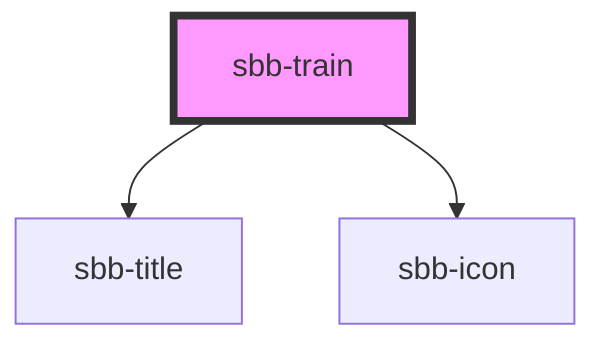

A `<sbb-train>` is a container element for one to x `<sbb-train-wagon`> or `<sbb-train-blocked-passage>`.
It has a direction indicator with a label for the travel direction and the destination station. 
It is used inside the sbb-train-formation element.

**Note:**
The accessibility-label should be used to give further information about the leaving direction of the train.
It should refer to the section where the locomotive is placed.

```html

<sbb-train 
  direction-label="driving direction"
  direction-label-level="3"
  station="Genève-Aéroport"
  direction="left"
  accessibility-label="The top of the train is in Sector A. The train leaves the station in this direction">
  ...
</sbb-train>
```

<!-- Auto Generated Below -->


## Properties

| Property                      | Attribute               | Description                                                                                  | Type                                     | Default     |
| ----------------------------- | ----------------------- | -------------------------------------------------------------------------------------------- | ---------------------------------------- | ----------- |
| `accessibilityLabel`          | `accessibility-label`   | Accessibility label for additional information regarding the leaving direction of the train. | `string`                                 | `undefined` |
| `direction`                   | `direction`             | Controls the direction indicator to show the arrow left or right. Default is left.           | `"left" \| "right"`                      | `'left'`    |
| `directionLabel` _(required)_ | `direction-label`       | General label for "driving direction".                                                       | `string`                                 | `undefined` |
| `directionLabelLevel`         | `direction-label-level` | Heading level of the direction label, used for screen readers.                               | `"1" \| "2" \| "3" \| "4" \| "5" \| "6"` | `'3'`       |
| `station`                     | `station`               | Label for the destination station of the train.                                              | `string`                                 | `undefined` |


## Slots

| Slot        | Description                         |
| ----------- | ----------------------------------- |
| `"unnamed"` | Used for slotting sbb-train-wagons. |


## Dependencies

### Depends on

- [sbb-title](../sbb-title)
- [sbb-icon](../sbb-icon)

### Graph


----------------------------------------------


