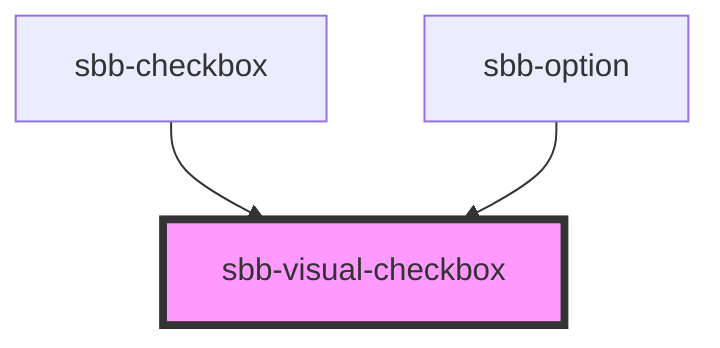

# sbb-visual-checkbox

<!-- Auto Generated Below -->

## Properties

| Property        | Attribute       | Description          | Type      | Default     |
| --------------- | --------------- | -------------------- | --------- | ----------- |
| `checked`       | `checked`       | Checked state.       | `boolean` | `undefined` |
| `disabled`      | `disabled`      | Disabled state.      | `boolean` | `undefined` |
| `indeterminate` | `indeterminate` | Indeterminate state. | `boolean` | `false`     |

## Dependencies

### Used by

 - [sbb-checkbox](../sbb-checkbox)
 - [sbb-option](../sbb-option)

### Graph

----------------------------------------------

