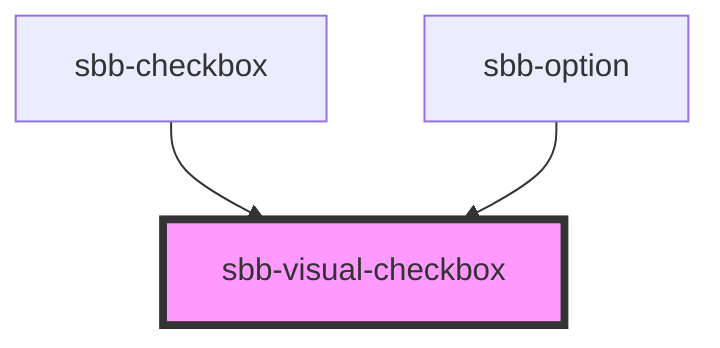

# sbb-visual-checkbox

The `sbb-visual-checkbox` is an 'internal-use-only' component used to display a non-interactive checkbox within an interactive component.
It is used in the `sbb-checkbox` component, and in the `sbb-option` component when it's used within a multiple `sbb-select`.

It has four different states related to the properties `checked`, `indeterminate` and `disabled`:
- a default unchecked state: an empty square is shown;
- a checked state (`checked` set to `true`): a tick appears in the square;
- an indeterminate state (`checked` unset and `indeterminate` set to `true`): a horizontal line is displayed in the square;
- a disabled state (`disabled` set to `true`): a grayed out empty square is shown.

<!-- Auto Generated Below -->

## Properties

| Property        | Attribute       | Description          | Type      | Default     |
| --------------- | --------------- | -------------------- | --------- | ----------- |
| `checked`       | `checked`       | Checked state.       | `boolean` | `undefined` |
| `disabled`      | `disabled`      | Disabled state.      | `boolean` | `undefined` |
| `indeterminate` | `indeterminate` | Indeterminate state. | `boolean` | `false`     |

## Dependencies

### Used by

 - [sbb-checkbox](../sbb-checkbox)
 - [sbb-option](../sbb-option)

### Graph

----------------------------------------------

