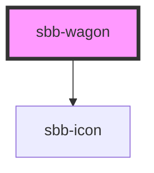

# sbb-wagon
A sbb-wagon represents a train compartment. It can be a locomotive, a blocked passage or a wagon. It is used inside the 
sbb-sector element. 

**Note:**
A sbb-wagon of type wagon has the possibilities of slotting icons. They will be applied internally 
into a list (ul>li) element and requires a title for the list as well as an aria-label for each slotted icon 
(see example below).

```html
<sbb-wagon type="locomotive" accessibility-label-wagon="Locomotive" accessibility-additional-wagon-text="Top of the train"></sbb-wagon>

<sbb-wagon type="blocked" accessibility-label-wagon="Passage blocked"></sbb-wagon>

<sbb-wagon type="wagon" accessibility-label-wagon="Train coach number" label="38"
           accessibility-label-occupation="Expected occupancy low" occupancy="low"
           accessibility-label-class="First class"
           accessibility-label-icon-list-title="Additional wagon information"
           wagon-class="1">
  <sbb-icon aria-hidden="false" aria-label="wheelchair space" name="sa-rs"></sbb-icon>
  <sbb-icon aria-hidden="false" aria-label="low-floor entry" name="sa-nf"></sbb-icon>
  <sbb-icon aria-hidden="false" aria-label="Business zone in 1st class: Reservation possible"
            name="sa-bz"></sbb-icon>
</sbb-wagon>
```

<!-- Auto Generated Below -->


## Properties

| Property                          | Attribute                             | Description                                                                                        | Type                                       | Default                              |
| --------------------------------- | ------------------------------------- | -------------------------------------------------------------------------------------------------- | ------------------------------------------ | ------------------------------------ |
| `accessibilityLabelIconListTitle` | `accessibility-label-icon-list-title` | Accessibility-text for translations as the list title for additional information icons on a wagon. | `string`                                   | `''`                                 |
| `additionalAccessibilityText`     | `additional-accessibility-text`       | Additional accessibility text which will be appended to the constructed default text.              | `string`                                   | `''`                                 |
| `blockedPassage`                  | `blocked-passage`                     |                                                                                                    | `"both" \| "next" \| "none" \| "previous"` | `'none'`                             |
| `customAccessibilityLabel`        | `custom-accessibility-label`          | Custom accessibility text to overwrite the constructed default text.                               | `string`                                   | `''`                                 |
| `iconListTitleId`                 | `icon-list-title-id`                  | This id will be forwarded to the relevant inner element.                                           | `string`                                   | ``sbb-wagon-list-title-${++nextId}`` |
| `label`                           | `label`                               | Visible label for the wagon number. Not used by type locomotive or blocked.                        | `string`                                   | `undefined`                          |
| `occupancy`                       | `occupancy`                           | Occupancy of a wagon.                                                                              | `"high" \| "low" \| "medium" \| "unknown"` | `'unknown'`                          |
| `type`                            | `type`                                | Wagon type.                                                                                        | `"closed" \| "locomotive" \| "wagon"`      | `'wagon'`                            |
| `wagonClass`                      | `wagon-class`                         | Visible class label of a wagon.                                                                    | `"1" \| "2"`                               | `undefined`                          |


## Slots

| Slot        | Description                                                        |
| ----------- | ------------------------------------------------------------------ |
| `"unnamed"` | Used to slot one to x icons for meta information of the sbb-wagon. |


## Dependencies

### Depends on

- [sbb-icon](../sbb-icon)

### Graph


----------------------------------------------


