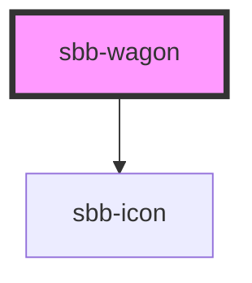

# sbb-wagon
A sbb-wagon represents a train compartment. It can be a locomotive or a wagon. It is used inside the 
sbb-train element. 

**Note:**
A sbb-wagon of type wagon has the possibilities of slotting icons. They will be applied internally 
into a list (ul>li) element and requires an aria-label for each slotted icon (see example below).

```html
<sbb-wagon type="locomotive" additional-accessibility-text="Top of the train"></sbb-wagon>

<sbb-wagon type="closed"></sbb-wagon>

<sbb-wagon type="wagon" label="38" occupancy="low" wagon-class="1" blocked-passage="next">
  <sbb-icon aria-hidden="false" aria-label="wheelchair space" name="sa-rs"></sbb-icon>
  <sbb-icon aria-hidden="false" aria-label="low-floor entry" name="sa-nf"></sbb-icon>
  <sbb-icon aria-hidden="false" aria-label="Business zone in 1st class: Reservation possible" name="sa-bz"></sbb-icon>
</sbb-wagon>
```

<!-- Auto Generated Below -->


## Properties

| Property                      | Attribute                       | Description                                                                           | Type                                       | Default     |
| ----------------------------- | ------------------------------- | ------------------------------------------------------------------------------------- | ------------------------------------------ | ----------- |
| `additionalAccessibilityText` | `additional-accessibility-text` | Additional accessibility text which will be appended to the constructed default text. | `string`                                   | `undefined` |
| `blockedPassage`              | `blocked-passage`               | Accessibility text for blocked passages of the wagon.                                 | `"both" \| "next" \| "none" \| "previous"` | `'none'`    |
| `customAccessibilityLabel`    | `custom-accessibility-label`    | Custom accessibility text to overwrite the constructed default text.                  | `string`                                   | `undefined` |
| `label`                       | `label`                         | Visible label for the wagon number. Not used by type locomotive or closed.            | `string`                                   | `undefined` |
| `occupancy`                   | `occupancy`                     | Occupancy of a wagon.                                                                 | `"high" \| "low" \| "medium" \| "unknown"` | `'unknown'` |
| `sector`                      | `sector`                        | Sector in which to wagon stops.                                                       | `string`                                   | `undefined` |
| `type`                        | `type`                          | Wagon type.                                                                           | `"closed" \| "locomotive" \| "wagon"`      | `'wagon'`   |
| `wagonClass`                  | `wagon-class`                   | Visible class label of a wagon.                                                       | `"1" \| "2"`                               | `undefined` |


## Slots

| Slot        | Description                                                        |
| ----------- | ------------------------------------------------------------------ |
| `"unnamed"` | Used to slot one to x icons for meta information of the sbb-wagon. |


## Dependencies

### Depends on

- [sbb-icon](../sbb-icon)

### Graph


----------------------------------------------